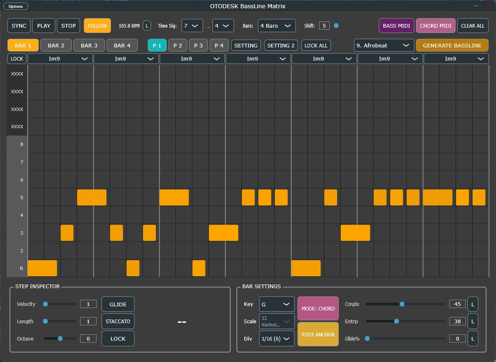

# BassLineMatrix

##

## Overview

**BassLineMatrix** is an advanced, open-source algorithmic MIDI sequencer and built-in synthesizer VST3/AU plugin. Driven by a highly optimized, real-time safe C++ architecture, it is designed to intelligently generate complex, genre-specific basslines and chord progressions across **23 distinct musical styles**.

Engineered for modern music production workflows, BassLineMatrix allows producers to instantly conjure everything from hypnotic Melodic Techno rolling basses and aggressive Drum & Bass neuro-lines, to soulful Neo-Soul walks and deeply syncopated Amapiano log-drum grooves. It acts as both an ultimate ideation tool and a reliable live-performance instrument.

👉 **[Watch the Demo Video on X (動作デモ動画はこちら！)](https://x.com/kijyoumusic/status/2041149139078234405?s=20)**

## Key Features

### 🧬 Algorithmic DNA Engine (23 Genres)

Instantly generate stylistically accurate patterns based on deeply researched genre DNA. The engine controls velocity curves, groove quantization (swing/drag), note lengths, and scale/chord relationships.

* **Included Genres:** Techno, House, UK Garage, Drum & Bass, Trap, Footwork, IDM, Dubstep, Afrobeat, Gqom, Amapiano, Indian/Bollywood, Latin/Reggaeton, Trance, Synthwave, Funk/Disco, New Jack Swing, Neo Soul, Boom Bap, Urban Jazz, Melodic Techno, Walking Bass, and Electronic Generic.

### 🎹 Advanced Sequencer & Matrix Grid

* **4 Independent Slots:** Store and switch between 4 variations seamlessly.
* **Intelligent Bar Settings:** Deep control over Time Signatures, Bar counts (up to 8 bars), Complexity, Entropy, and Auto-Glide probabilities.
* **Scale & Chord Modes:** Snap to 40 distinct musical scales or use the advanced Chord Mode supporting 15 chord qualities with deep inversion controls.

### 🎛️ Built-in TPT/ZDF Synthesizer Engine

Comes equipped with an internal, zero-latency synthesizer module tailored for bass and chord previewing.

* **Topology-Preserving Transform (TPT) Filters:** Utilizes ultra-stable, Zero-Delay Feedback (ZDF) lowpass filters to ensure analog-like resonance without phase warping or 1-sample delay artifacts.
* **Mono Truncation & Glide:** Flawless monophonic bass behavior with variable glide times and staccato gating ratios.

### 📤 Seamless Workflow Integration

* **MIDI Drag & Drop:** Instantly export the generated Bass and Chord MIDI sequences directly into your DAW timeline for further arrangement and sound design.

### ⚡ Extreme Real-Time Optimization & DAW Safety

Built by a Senior DSP Architect, the plugin strictly adheres to real-time safety rules to guarantee zero dropouts, especially in demanding hosts like Ableton Live:

* **Lock-Free State Swapping (Double Buffering):** UI-to-DSP data transfer is handled via atomic pointer swapping ($O(1)$ overhead). Absolutely zero heap-allocations (`new`/`malloc`) or heavy `memcpy` operations occur on the audio thread.
* **VBlank-Driven UI Synchronization:** The GUI is completely decoupled from the DSP thread and driven by JUCE 8's `VBlankAttachment`, synchronizing the sequencer playhead exactly with your monitor's refresh rate, slashing CPU/GPU overhead.
* **DAW Jitter & Hot-Reset Protection:** Built-in fail-safes dynamically detect asynchronous sample-rate changes and playhead jitter (notorious in Ableton Live), triggering safe internal resets to prevent NaN generation and catastrophic audio spikes.

## System Requirements & Compatibility

* **OS:** Windows 10 / Windows 11 (64-bit) **[Windows Only]**
* **Format:** VST3
* **Tested Host:** Ableton Live 11 / 12

⚠️ **Compatibility Notice:** This plugin is compiled and heavily optimized exclusively for Windows (AVX2 required). It has been strictly verified to work in **Ableton Live**. Operation and stability on other DAWs (FL Studio, Bitwig, Studio One, Cubase, etc.) are currently **unverified and unsupported**. Use at your own risk outside of Ableton Live.

## Installation

1. Download the latest `BassLineMatrix.vst3` file from the [[Releases](https://github.com/OTODESK4193/BassLineMatrix/releases/latest)] page.
2. Move the `.vst3` file to your default Windows VST3 plugin directory:
`C:\Program Files\Common Files\VST3`
3. Rescan your plugins in Ableton Live.

## 📚 User Guide

A comprehensive manual covering detailed technical specifications and operational guidelines is included with this repository.

[ -red?style=for-the-badge&logo=adobe-acrobat-reader) ](./Source/Assets/BassLineMatrix_OfficialUserManual_JP.pdf)

[ -red?style=for-the-badge&logo=adobe-acrobat-reader) ](./Source/Assets/BassLineMatrix_OfficialUserManual_EN.pdf)

## Disclaimer & Stability

This software is provided "as-is", without any warranty of any kind.
While extreme care has been taken to ensure real-time safety and prevent audio dropouts through lock-free architectures and fail-safes, unexpected behavior may still occur depending on extreme parameter randomization.

## License

This project is completely free and open-source. It is distributed under the **GPLv3 License** (inherited via the JUCE framework). You are free to study, modify, and distribute the source code under the same terms.

## 🎓 Credits

**Developer**: @kijyoumusic (OTODESK)

**Music Production Background**: Electronic Music, Sound Design, DSP Engineering

**Target DAW**: Ableton Live 11+

**Framework**: JUCE 8.0.8

---

## 📞 Support

* **Social**: [@kijyoumusic](https://x.com/kijyoumusic)

